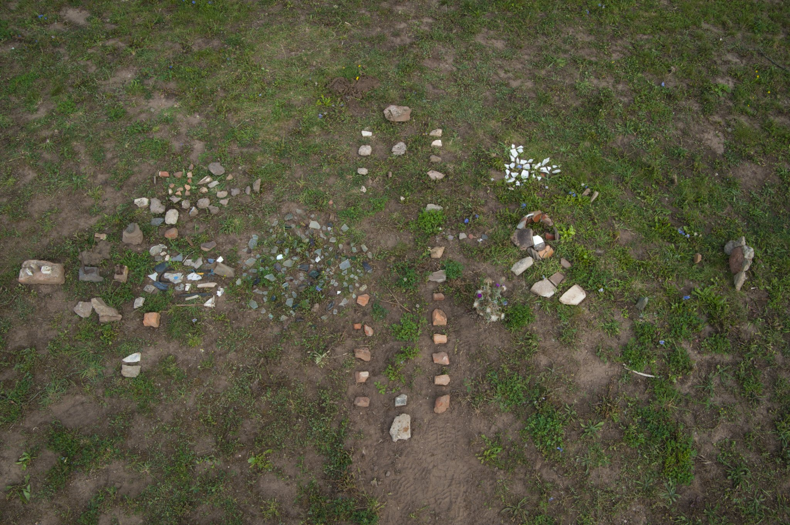
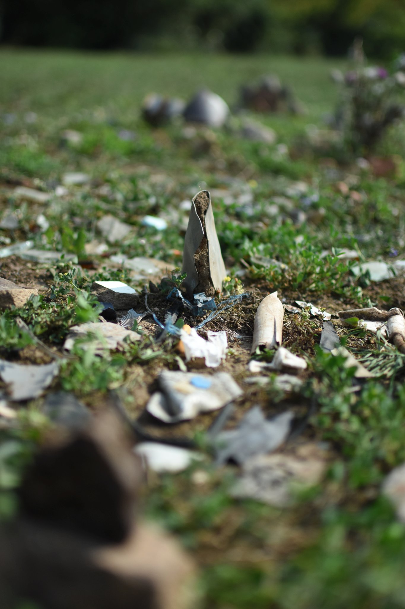
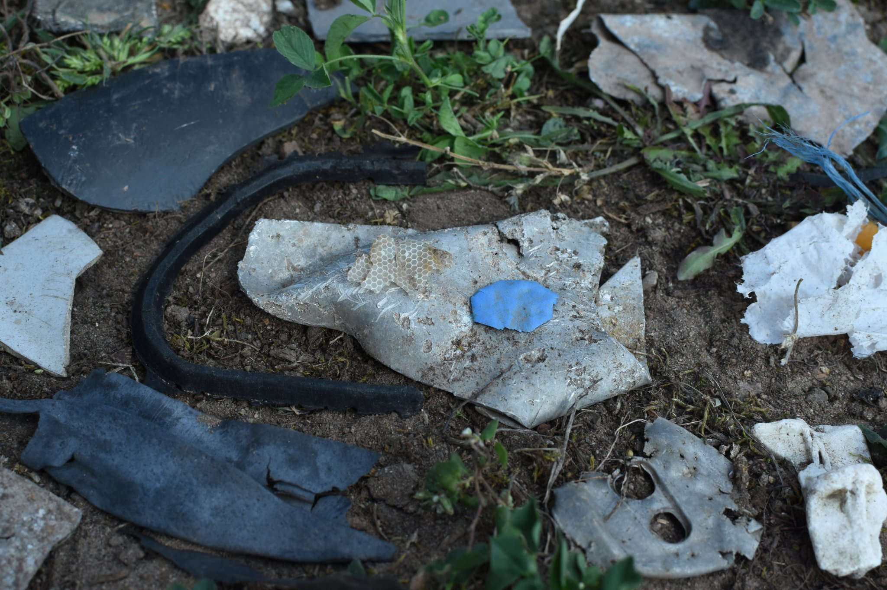

```{r, fig.fullwidth = TRUE, echo = FALSE}

```


```{marginfigure}
Joachim Jacob, born 1959, studied biology, philosophy and architecture. His architectural spatial art is concerned with questions of spacial structure in nature, with ornament and space itself.     e-mail: joachimjacob@gmx.de
```
```{marginfigure}
Dr. Florian D. Schneider, born 1981, ecologist and environmental scientist. His doctoral thesis (2012) was on food web relations in the forest floor. Today, he investigates biodiversity and insect decline due to human land use.   http://www.fdschneider.de;     Twitter: [f_d_schneider](https://twitter.com/f_d_schneider);     Instagram: [fdschn](https://www.instagram.com/fdschn/)
```


# The distant future ...

This communication has been taking place via quantum entanglement between two science officers (F & J) on a spaceship exploring the orion arm of the milky way and a correspondent political officer (O) on their homeworld (undisclosed location 1691 lightyears away). 
Along with the communication, several images have been transmitted. 
Crackling noises and interruptions in this recording are due to the imperfect digital reading of the quantum state at receiver side.

>> F: *"We found this habitable planet on the outer arm of the galactic arm. At first it seemed lacking a civilised species, with mostly barren ground with sparse vegetable life forms."* 

>> J: *"At closer look, we found a wealth of civilisatory artefacts scattered on the ground. We immediately initiated the archaeological reconstruction protocol."*

>> M: *"Please report what you found!"*

>> J: *"The materials were laid out according to protocol, spanning from shaped rock to high-energy compounds. We estimate the artefacts covered a span of only 150 revolutions around the star."*


>> F: *"That is a first estimate. I don’t have to add that this is a remarkably short period for such development. But we need to date the artefacts via radiocarbon analysis to be certain."*

>> J: *"Yes. But I am confident. The stratigraphic layers showed clear signs of ..."*

>> M: *"spare me the details. Continue!"*

>> J: *"The civilisation was capable of constructing advanced dwellings. We found hewn stone or burnt clay bricks, in the earlier phase, and industrial scale mineral chemistry applications in the later phase. The forms of the building materials were almost exclusively rectangular or spherical, with hardly any organic references.  We thus suspect that the architecture was spanning rather wide spaces and was arranged in strict alleyways."*


```{r, fig.fullwidth = FALSE, echo = FALSE}
knitr::include_graphics('assets/detail_01.JPG')
```


```{r, fig.fullwidth = FALSE, echo = FALSE}
knitr::include_graphics('assets/detail_05.JPG')
```


```{r, fig.fullwidth = FALSE, echo = FALSE}
knitr::include_graphics('assets/detail_02.JPG')
```

>> *"We also found proof of silicate glass melting for producing translucent materials, mostly for construction. The glass shards appear to us as practical rather than ornamental.  Thus, the dwellings must have been above ground. Use of ground must have been immense."*


```{r, fig.fullwidth = TRUE, echo = FALSE}
knitr::include_graphics('assets/detail_06.JPG')
```

>> F: *"This indicates an uncreative culture, that sets itself apart from nature. However, at the same time, we found these rare shards of painted ceramics with abstract images of natural objects. Some were also bearing what looks like lettering. They clearly possessed language and imaginative minds."*


```{r, fig.fullwidth = FALSE, echo = FALSE}
knitr::include_graphics('assets/detail_04.JPG')
```


>> J: *"This is what puzzles us: the mineral based artefacts we found were shifting from long-lasting steel alloys and ceramics or glass in the earlier ages to lightweight aluminium and plastics in the later times. It is as if they consciously esteemed low-quality and disposability over permanence. What a very irresponsible cultural turn for a civilisation capable of such creativity!"*


```{r, fig.fullwidth = FALSE, echo = FALSE}

```


```{r, fig.fullwidth = FALSE, echo = FALSE}

```


>> M: *"It is indeed! Please, what became of the civilisation?"*

```{r, fig.fullwidth = TRUE, echo = FALSE}
knitr::include_graphics('assets/detail_10.JPG')
```


>> F: *"There is indication of a rapid end: Use of polymers has grown so common in the later era, that we find microparticles literally everywhere. The huge amount can only be produced from fossil resources. Which is also what we suspect to be their source of electric energy. Have a look at these objects, copper wire circuits and resistors, which clearly indicate that they were harnessing electricity. That is astonishing. At a usage of fossil resources at this rate and volume, I wouldn’t expect to find any remaining fossil carbohydrate reservoirs left. As we now, this behaviour causes dramatic atmospheric change. I suspect this also to be the cause ... "*

>> J: *"No ..."*

>> F: *" ... of their extermination."*

>> J: *" ... I object! We cannot jump to conclusions. There are other things to be taken into account."*

>> M: *"What is your alternative hypothesis?"*  

>> J: *"External causes! For instance, these findings of obsidian rock point to the volcanic activity of the planet. The eruptions come in cycles much longer than the rise of this civilisation and may have caused great turmoil as they were hit unprepared. The other possibility is an asteroid impact from space."*

>> F: *"Those theories are valid, but such an incident would show in the record. As long as there is no counterindication, I find the internal-cause theory much more convincing ..."*

>> M: *"Stop it! You will settle this dispute later. We need to come to a conclusion: I take that the planet is currently uninhabited?"* 

>> F: *" Not exactly ... "*

>> J: *"There are ... four-legged life forms of furry skin roaming around. While I’m speaking there are two of them lying in the shade of a larger tree next to our excavation site. But they are paying us very little attention. I think they are ... ruminating."*

>> F: *"I’ve observed them eating herbs from the ground. They do not engage in any abstract activities."*

>> J: *"Their shi... droppings ... fall on the ground where they stand and are composted into the soil. It seems to be an act of giving back to nature."*

>> F: *"A closed cycle. An earth-based life."* 

>> M: *"(sighs) It seems, we came too late. That rowdy civilisation would have justified an invasive interference according to the galactic law.  But the current inhabitants seem to manage their planet sustainably. We have nothing to do here. Return to orbit immediately and continue your search!  Homeworld over and out."*


```{marginfigure}
Alle Fotos und Texte © Joachim Jacob & Florian D. Schneider; for reproduction or further information: [e-mail](mailto:florian.dirk.schneider@gmail.com); This project page is part of the website http://fdschneider.de.
```

# Context

During GNAP 2019 we came to the periurban organic farm Oberfeld in Darmstadt. We walked around the pastures and started to find glass shards and other objects in the grass. 

The 'Anthropocene' is the currently debated new geological epoch, where human activity has reached every corner of planet earth, affecting all life. The remnants of human civilisation are the marker of this epoch, just as certain fossils mark earlier shifts in geological strata. Based on these findings, future geologists will be able to detect the existence of human civilisation and investigate the causes of their fall. 

Standing at the brink of the Anthropocene, we have the choice if this becomes a major rift that threatens the conditions for our own existence or a minor change to a new world within safe boundaries.

# visit 

The work is currently part of the exhibition 'Nature Art Fieldworks' at the international Forest Art Center in Darmstadt. 

The exhibition is open until Friday, 4 October, Mondays to Thursdays 9a.m. - 3 p.m. and Fridays 9 a.m. - 2p.m.. (https://2019.gnap.info/en/)

```{marginfigure}
<a href="https://www.openstreetmap.org/?mlat=49.84874&amp;mlon=8.65324#map=19/49.84874/8.65324">Größere Karte anzeigen</a>
```

<p>
<iframe width="950" height="700" frameborder="0" scrolling="no" marginheight="0" marginwidth="0" src="https://www.openstreetmap.org/export/embed.html?bbox=8.639094829559328%2C49.841663527289725%2C8.667418956756594%2C49.85581782911181&amp;layer=mapnik&amp;marker=49.84873946680342%2C8.653243482112885" style="border: 0px solid black; ; max-width: 100%;"></iframe>
</p>

